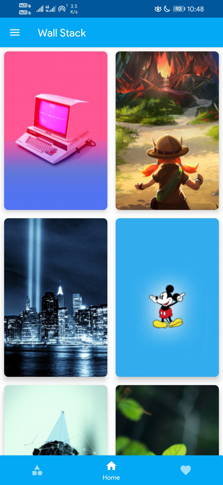
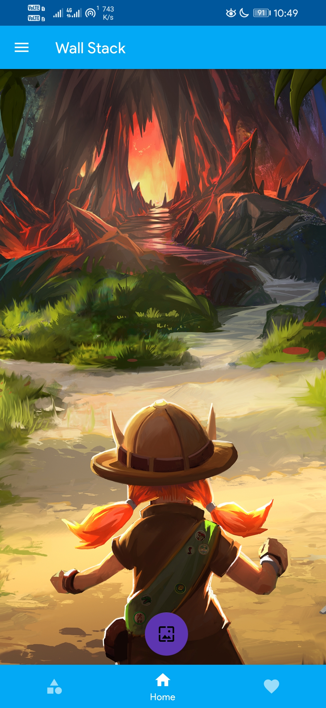
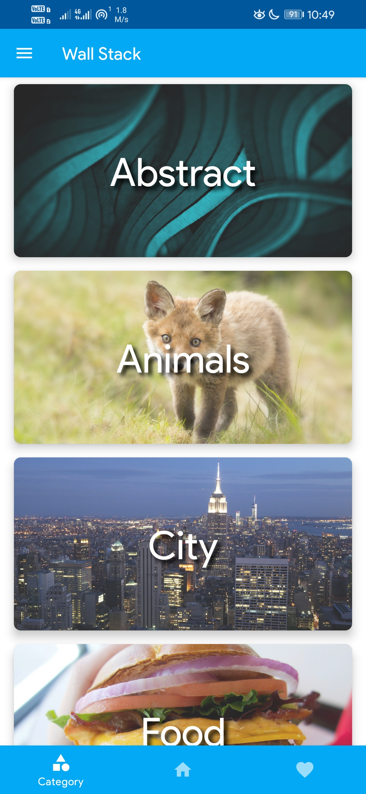

# Wall-Stack

## About the App
A wallpaper app which uses wallheaven's api to fetch cool wallpapers and helps to set them as homescreen wallpaper.   
This app is created in #30DaysOfKotlin challenge. 

Demo [Video](docs/wallstack.mp4)

## Screenshots
<table>
        <tr>
          <td></td>
          <td></td>
          <td></td>
        </tr>
</table>    

## Built with the help of
- Kotlin
  - Data classes
  - String Templates
  - Late initialization property
  - Coroutines
  - Lambdas  
- Coroutines
- Jetpack Navigation Components
- Material Design Components
- Retrofit
- Glide
